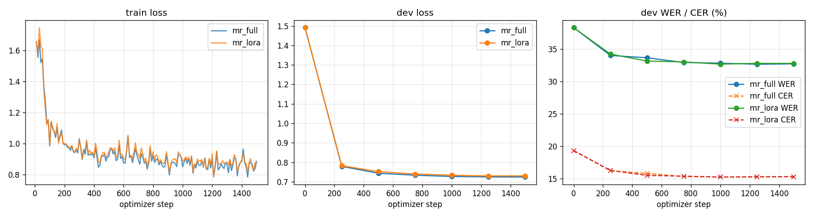

# Fine-tuning Bodhan Indic-Transcribe (ASR) on conversational Marathi

End-to-end fine-tuning of [`bodhan-ai/indic-transcribe-core`](https://huggingface.co/bodhan-ai/indic-transcribe-core)
(1.2B-param FastConformer + Transformer AED, a Canary-1B-v2 derivative) on
[SPRING-INX Marathi R2](https://huggingface.co/datasets/SPRINGLab/SPRING_INX_Marathi_R2)
(IIT Madras SPRING Lab; conversational, code-mixed Marathi).

All runs were done on Google Colab (A100 80GB). The notebook is in `notebooks/`; its
`%%writefile` cells hold the first version of the code, and the final runs used this
repository's code (`scripts/run_pipeline.sh` is the one-command, resumable way to reproduce).

## Results

Official SPRING-INX Marathi **test split** (1,929 utterances, 5.05 h), never used for
training or checkpoint selection. WER/CER on normalised text (see *Training setup* below).

| model | prompt mode | test WER % | test CER % |
|---|---|---|---|
| Indic-Transcribe-Core, zero-shot | native | 41.33 | 20.88 |
| Indic-Transcribe-Core, zero-shot | mixed | 41.19 | 20.85 |
| **+ full fine-tuning (this repo)** | mixed | **35.76** | **16.94** |
| + LoRA r=32 on all attention projections | mixed | 35.90 | 17.08 |

**-5.4 WER points (-13.2% relative), -3.9 CER points (-18.8% relative)** after 21 minutes
of training on one A100 (1,500 steps ≈ 4.2 epochs over 45 h of audio).

**Reproducibility:** the full fine-tuning run was (accidentally) executed twice with the
same config; the two runs reached **35.90 / 16.96** and **35.76 / 16.94** test WER / CER.
The 0.14-point spread is small next to the 5.4-point gain, so the improvement is not a
lucky seed. The shipped checkpoint is from the second run.

**Full fine-tuning vs. LoRA.** LoRA trains 21M parameters (1.7% of 1.24B) and its
checkpoint is ~85 MB instead of 2.4 GB, yet it recovers **97% of the full fine-tuning gain**
(-5.29 vs -5.43 WER points). The 0.14-point gap equals the run-to-run spread of full
fine-tuning, so on this data the two are statistically indistinguishable. This is consistent
with the next observation: the adaptation needed is low-rank - conventions and domain, not
new acoustics. For deploying many per-domain/per-dialect variants on one base model, LoRA is
the clear choice; full FT remains the safer default when data grows substantially.

| | full FT | LoRA r=32 |
|---|---|---|
| trainable params | 1,221M (100%) | 21M (1.7%) |
| checkpoint | 2.4 GB (bf16) | ~85 MB |
| LR | 1e-5 | 2e-4 |
| best dev WER (step) | 32.68 (1250) | 32.70 (1000) |
| test WER / CER | 35.76 / 16.94 | 35.90 / 17.08 |

Dev-set trajectory of the shipped run (1,000-utterance subset of the official validation
split, used for model selection):

| step | 0 (zero-shot) | 250 | 500 | 750 | 1000 | 1250 (best) | 1500 |
|---|---|---|---|---|---|---|---|
| dev WER % | 38.34 | 34.04 | 33.68 | 32.95 | 32.85 | **32.68** | 32.74 |
| dev CER % | 19.32 | 16.20 | 15.78 | 15.31 | 15.24 | **15.24** | 15.27 |
| dev loss | 1.49 | 0.78 | 0.74 | 0.73 | 0.73 | 0.73 | 0.72 |

Most of the gain arrives in the first 250 steps and the curve is flat after ~1,000 steps:
the model already knows Marathi, and what it learns here is mostly the corpus's
**conventions and domain** - English loanwords written in Latin script, colloquial
spellings, conversational vocabulary - rather than new acoustics. That is also why more
epochs on the same 45 h would not help; more *data* (37 unused shards) would be the lever.



### What changed, qualitatively

From [`docs/results.md`](docs/results.md) (utterances whose WER changed most):

| | text |
|---|---|
| REF | TELCECIGNOUNIOSNITTR आणि IIMB Platform |
| zero-shot | टी ई एल सी ई सी आय जी एन ओ यू एन आय ओ ओ एस एन आय टी टी आर आणि आय आय एम बी प्लॅटफॉर्म |
| fine-tuned | TELCECIGNOUNIOSNITTR आणि IMB platform |
| REF | काय आहे तुम्ही जर **time** भराला असता ... |
| zero-shot | काय तुम्ही जर **टाईम** भराला असता ... |
| fine-tuned | काय आहे तुम्ही जर **time** भराला असता ... |
| REF | हम्म |
| zero-shot | ठीक आहे |
| fine-tuned | हम्म |

The model learned the corpus conventions: acronyms and English words stay in Latin
script, and fillers (`हम्म`, `हा`) are transcribed literally instead of being "normalised"
into different words.

**Failure mode found - repetition loops.** On one test utterance the fine-tuned model
emitted `ओके` ~60 times (utt WER 88% -> 412%). This is the classic greedy-decoding loop of
AED models on hesitant, filler-heavy speech; a single such utterance costs ~0.3 WER points
on this test set. Cheap mitigations not applied here (to keep base vs. fine-tuned decoding
identical): `no_repeat_ngram_size=3` / `repetition_penalty`, capping `max_new_tokens`
by audio duration, or beam search. Several references are also visibly truncated (e.g. a
reference of just `time` for a long utterance), which inflates WER for *every* model.

Artefacts (Google Drive): best checkpoint (bf16, self-contained), `train.log`,
`history.jsonl`, TensorBoard events, per-utterance test predictions for every model, and
the prepared manifests.

## Repository layout

```
configs/
  mr_full.yaml         full fine-tuning (main run)
  mr_lora.yaml         LoRA variant (parameter-efficient comparison)
scripts/
  prepare_data.py      parquet shards -> 16 kHz FLAC + NeMo-style JSONL manifests
  smoke_test.py        load, decode 6 clips, 1 optimizer step - run before any long job
  train.py             fine-tuning entry point (YAML config + key=value overrides)
  evaluate.py          WER/CER of base model or a checkpoint, writes per-utterance predictions
  report.py            training curves, results table, biggest wins/regressions
src/bodhan_asr/
  config.py            typed dataclass config
  data.py              data prep, manifest dataset, duration-bucketed batch sampler
  model.py             training adapter around the (inference-only) upstream HF port
  trainer.py           explicit training loop: bf16, warmup+cosine, WER model selection
  text.py              target cleaning vs. scoring normalisation
  metrics.py           corpus WER / CER
notebooks/
  bodhan_asr_marathi_colab.ipynb   the notebook that produced the results
```

## Reproduce

```bash
pip install -r requirements.txt
# HF token with access to the gated bodhan-ai/indic-transcribe-core repo
huggingface-cli download bodhan-ai/indic-transcribe-core --exclude "nemo/*.nemo" \
    --local-dir /content/models/indic-transcribe-core
python scripts/prepare_data.py --raw_dir /content/data/raw --out_dir /content/data/prepared --download
python scripts/smoke_test.py configs/mr_full.yaml
python scripts/train.py --config configs/mr_full.yaml
python scripts/evaluate.py --config configs/mr_full.yaml --split test --tag base_mixed \
    --out_dir /content/runs/baseline
python scripts/evaluate.py --config configs/mr_full.yaml --split test --tag finetuned \
    --checkpoint /content/runs/mr_full/best
python scripts/report.py --runs /content/runs/mr_full --baseline /content/runs/baseline --out docs
```

The saved `best/` directory is self-contained (weights + upstream code, tokenizer and
feature extractor), so it also loads with Bodhan's own wrapper:

```python
import sys; sys.path.insert(0, "runs/mr_full/best")
from indic_transcribe import IndicTranscribe
asr = IndicTranscribe.from_pretrained("runs/mr_full/best")
print(asr("clip.wav", lang="mr", mode="mixed"))
```

## Approach

### 1. Choosing the model

| model | backbone | size (bf16) | verdict |
|---|---|---|---|
| Indic-Translate | Gemma-4 E4B | ~16 GB | trainable only with QLoRA; long download; MT eval is noisy |
| Indic-Speak | Llama-3.2-3B + Vocos codec | ~7 GB | needs an audio *encoder* to tokenise targets; the repo ships only the decoder side |
| **Indic-Transcribe** | FastConformer + Transformer AED | ~2.4 GB | **chosen**: fits comfortably, clean objective (CE on text), unambiguous metrics (WER/CER) |

ASR also gives the most honest "did fine-tuning do anything" signal: a zero-shot
baseline on the same test set, measured with the same code.

### 2. Choosing the data

SPRING-INX Marathi R2 (76k train utterances, ~350 h total, CC-BY-4.0) was picked over
read-speech corpora because it is **conversational and code-mixed** - speakers switch into
English and Hindi mid-sentence - which is exactly where a general model is weakest and
where the corpus's transcription conventions (English words in Latin script, punctuation)
differ from the model's defaults. The smoke test showed this immediately:

```
REF: company च्या आर्थिक संरचनेमध्ये ...        REF: त्याच्यामधे late हौन जाते रात्री.
HYP: कंपनीच्या आर्थिक संरचनेमध्ये ...           HYP: त्याच्यामध्ये लेट होऊन जातो रात्री
```

For time/budget reasons I used **10 of 47 train shards (16,260 utterances, 45.3 h)**,
a fixed random **1,000-utterance dev subset** of the official validation split for model
selection, and the **full official test split (1,929 utterances, 5.05 h)** for reporting.

Data preparation (`scripts/prepare_data.py`):
- decode to mono 16 kHz FLAC (the corpus is already 16 kHz PCM - verified, so no
  resampling happens; this matters because the model card warns that only torchaudio's
  `sinc_interp_hann` matches training-time resampling);
- NFC-normalise text, strip annotation tags, **keep punctuation and Latin-script words**;
- filters (train/dev only): 0.5-30 s duration (model trained with `max_duration: 30`),
  >25 chars/s (misaligned segments), empty text. Dropped: 14 too long, 33 chars/s, 3 empty.
  The test split is only filtered for decodability/emptiness so numbers stay comparable;
- manifests use the NeMo format so the same data also works with NeMo's
  `speech_to_text_aed.py` if one wants the official recipe.

### 3. Making an inference-only port trainable

The released HF code is explicitly inference-only (`forward(labels=...)` raises
`NotImplementedError`). Rather than patch upstream files, `src/bodhan_asr/model.py` wraps them:

- **Loss**: teacher-forced cross-entropy over `prompt + target + <eos>`. Targets are the
  multilingual SentencePiece ids offset by 1152 (the aggregate-tokenizer layout). The fixed
  10-token canary2 prompt is **masked out of the loss**, as in NeMo.
- **Prompt / output mode**: the model has three output modes selected by prompt slots
  (`native`, `mixed`=ITN, `romanised`). SPRING-INX writes English loanwords in Latin
  script, which matches `mixed`, so both training and evaluation use the `mixed` prompt
  (`<|mr|><|mr|><|pnc|><|itn|>…`). The baseline is reported in both modes so the choice is
  visible, not hidden.
- **Features** come from the upstream `IndicCanaryFeatureExtractor` on the GPU (bit-exact
  with inference), with short clips centre-padded to 1 s exactly like the upstream wrapper.
- **SpecAugment** (2×27 freq masks, 10×5% time masks - Canary defaults): the port contains
  no dropout at all, so this is the main regulariser.
- **BatchNorm running stats frozen**: the FastConformer conv module has BatchNorm; letting it
  re-estimate statistics from small, padding-contaminated fine-tuning batches is a classic way
  to silently degrade a pretrained conformer.
- **Checkpoints** are saved as a bf16 *copy* of the fp32 master weights (2.4 GB instead of
  4.9 GB) plus the upstream code/tokenizer/feature-extractor files, so a checkpoint dir is a
  drop-in replacement for the original repo.
- Strategies: `full`, `decoder_only`, `lora` (LoRA injected with `peft.inject_adapter_in_model`
  so the upstream `generate()` signature is untouched).

### 4. Training setup

| | value | why |
|---|---|---|
| strategy | full fine-tuning | A100 80GB makes it affordable (peak ~51 GB); the model already knows Marathi, we are adapting domain + conventions |
| LR | 1e-5, 150 warmup, cosine to 10% | low LR to limit catastrophic forgetting of the other 24 languages |
| batching | duration buckets, ≤600 padded audio-seconds, ≤48 utts | conversational clips range 0.5-30 s; bucketing cuts padding waste |
| precision | bf16 autocast, fp32 master weights | A100 native; no loss scaling needed |
| optimiser | AdamW (β2=0.98), WD 0.01 (not on norms/biases/embeddings), clip 1.0 | standard for AED transformers |
| model selection | dev WER every 250 steps, early stopping patience 3 | select on the metric we report, not on loss |
| step-0 eval | zero-shot dev WER logged before any update | the baseline and the fine-tuned model share code paths |

WER/CER are computed on **normalised** text (NFC, punctuation removed, lower-cased Latin,
zero-width chars dropped) for both reference and hypothesis, so the metric measures words
rather than punctuation conventions. Predictions keep punctuation.

## Challenges and how they were handled

- **Gated model + fine-grained HF token**: the first token returned 403 on every Bodhan repo
  even after licence acceptance; fine-grained tokens need the "public gated repos" read
  permission. Diagnosed with a small script that checks each repo's `config.json`.
- **Inference-only upstream code**: implemented the loss, prompt masking, SpecAugment and BN
  freezing in a wrapper instead of forking upstream files (keeps parity with the released model).
- **Silent weight corruption trap**: upstream `_init_weights` is deliberately a no-op because
  transformers 5.x re-initialises after loading. Any wrapper that re-enabled init or cast the
  live model would corrupt weights without an error - hence the bf16 *copy* on save and a
  smoke test that decodes real audio before any long run.
- **Transcript conventions vs. model conventions**: references mix scripts and punctuation
  inconsistently; handled with the `mixed` prompt for training and normalised scoring.
- **Noisy references**: several references omit words that are clearly spoken (the model's
  zero-shot hypothesis contains them). This caps attainable WER and means small WER changes
  should be read with care; the per-utterance prediction files make this auditable.
- **Colab VM recycled mid-session**: the first complete training run (identical results
  on dev) was lost when Colab recycled the VM, because outputs lived only on the VM disk.
  Fix: `scripts/run_pipeline.sh` - a resumable pipeline that copies each stage's outputs
  to Google Drive as soon as it finishes and skips stages already marked done, so a
  disconnect costs at most one stage. Long jobs also run as background processes (logs +
  TensorBoard on disk) so the notebook stays responsive.
- **Colab dependency clash**: the LoRA run first died at import time - Colab preinstalls
  `torchao 0.10`, and recent `peft` refuses to import next to any torchao older than 0.16.
  Nothing here uses torchao, so the pipeline uninstalls it rather than pinning peft.
- **Accidental duplicate run**: re-running the notebook's training cell launched a second
  full run into the same output directory while the first had finished; it overwrote
  `best/` and appended to the logs. Rather than kill it half-way (which would have left a
  half-trained `best/`), I let it finish, re-evaluated its checkpoint, and used the pair
  as a reproducibility check. The trainer now refuses to start in a directory that
  already holds a run unless `train.overwrite_output_dir=true`.
- **Checkpoint trust**: the smoke test saves, reloads and re-decodes a checkpoint before
  any long run, so a save/load bug surfaces in minute one rather than after training.

## Limitations / next steps

- Only 45 h of the ~300 h train split were used; the pipeline scales by changing `--train_shards`.
- Forgetting on other languages was not measured - a Hindi/English sanity set would be the
  first thing to add before shipping.
- Beam search, LM fusion and a NeMo-recipe comparison run were out of scope for the time box.
